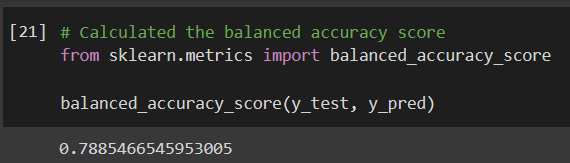
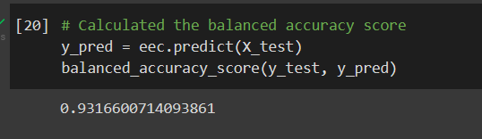
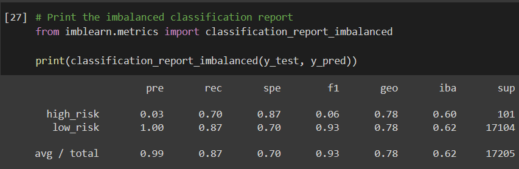
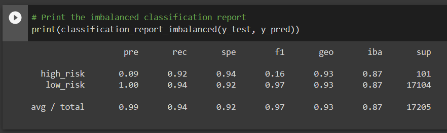

# Credit Risk Analysis

## Credit Risk Analysis Overview

Testing out multiple machine learning algorithms to determine which is best to use to predict credit risk.

## Credit Risk Analysis Results

### Balanced Accuracy

- The balanced accuracy scores for each are as follows:

#### Oversampling

- oversampling came out to 64%

#### SMOTE

- SMOTE came out to 66%

#### Undersampling

- undersampling came out to 54%

#### SMOTEENN

- combination or SMOTEENN came out to 67%

#### Balanced Random Forest Classifier

- the Balanced Random Forest Classifier came out to 79%

#### Easy Ensemble AdaBoost Classifier

- the Easy Ensemble AdaBoost Classifier came out to 93%

### Precision and Recall

- The precision and recall scores for each are as follows:

#### Oversampling

- oversampling showed the high_risk precision at 1% and low_risk at 100% with the recall for high_risk showing 69% and low_risk showing 59%.

#### SMOTE

- SMOTE showed the high_risk precision at 1% and low_risk at 100% with recall for high_risk at 63% and low_risk showing 69%.

#### Undersampling

- undersampling showed the high_risk precision at 1% and low_risk at 100% with the recall for high_risk showing 69% and low_risk showing 40%.

#### SMOTEENN

- SMOTEENN showed the high_risk precision at 1% and low_risk at 100% with recall for high_risk at 76% and low_risk at 59%.

#### Balanced Random Forest Classifier

- the Balanced Random Forest Classifier showed the high_risk precision at 3% and low_risk at 100% with the recall for high_risk at 70% and the low_risk at 87%.

#### Easy Ensemble AdaBoost Classifier

- the Easy Ensemble AdaBoost Classifier showed the high_risk precision at 9% and low_risk at 100% with the recall for high_risk at 92% and the low_risk at 94%.

## Credit Risk Analysis Summary 

From what I could gather in my analysis, the Easy Ensemble AdaBoost Classifier came out with the best results with the balanced accuracy score of 93%. I would recommend using Easy Ensemble AdaBoost Classifier as it has the best results and would provide the most accuracy.

## Resources
- Software: [Python](https://www.python.org/), [Visual Studio Code](https://code.visualstudio.com/), 1.65.2, Jupyter Notebook, [Google Colab](https://colab.research.google.com/notebooks/welcome.ipynb)
