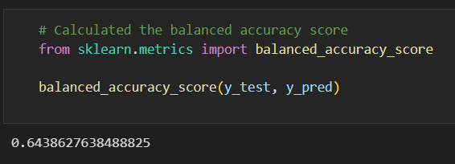
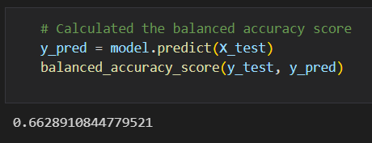
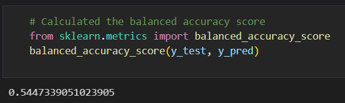
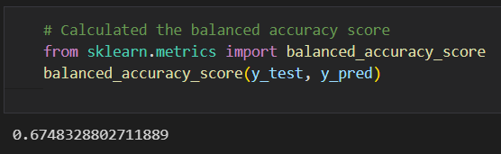
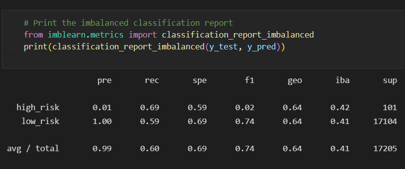
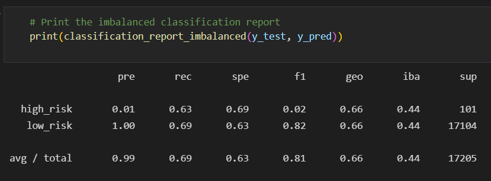
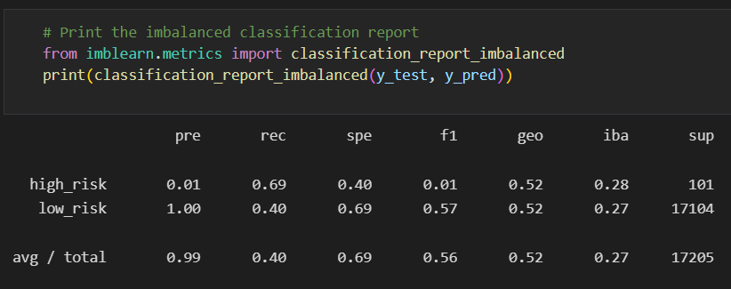
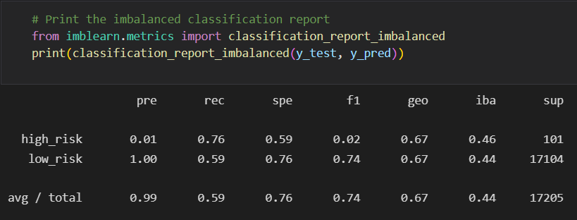

# Credit Risk Analysis

## Credit Risk Analysis Overview

Testing out multiple machine learning algorithms to determine which is best to use to predict credit risk.

## Credit Risk Analysis Results

Due to an apparent issue (could not be resolved with BCS Learning Assistants, even when using different computers I had the same errors occurring) in the scikit-learn module where the Classifier doesn't work with the updated scikit-learn, I was unable to fully finish my analysis on Deliverable 3 using the ensemble learners. So these results will only be able to cover Deliverables 1 and 2, with oversampling, SMOTE, undersampling, and combination or SMOTEENN.

### Balanced Accuracy

- The balanced accuracy scores for each are as follows:

#### Oversampling

- oversampling came out to 64%

#### SMOTE

- SMOTE came out to 66%

#### Undersampling

- undersampling came out to 54%

#### SMOTEENN

- combination or SMOTEENN came out to 67%

### Precision and Recall

- The precision and recall scores for each are as follows:

#### Oversampling

- oversampling showed the high_risk precision at 1% and low_risk at 100% with the recall for high_risk showing 69% and low_risk showing 59%.

#### SMOTE

- SMOTE showed the high_risk precision at 1% and low_risk at 100% with recall for high_risk at 63% and low_risk showing 69%.

#### Undersampling

- undersampling showed the high_risk precision at 1% and low_risk at 100% with the recall for high_risk showing 69% and low_risk showing 40%.

#### SMOTEENN

- SMOTEENN showed the high_risk precision at 1% and low_risk at 100% with recall for high_risk at 76% and low_risk at 59%.

## Credit Risk Analysis Summary 

From what I could get to work in my analysis, the combination learner, or SMOTEENN came out with the best results with the balanced accuracy score of 67%. I would recommend using SMOTEENN as it has the best results with the combination.

## Resources
- Software: [Python](https://www.python.org/), [Visual Studio Code](https://code.visualstudio.com/), 1.65.2, Jupyter Notebook
